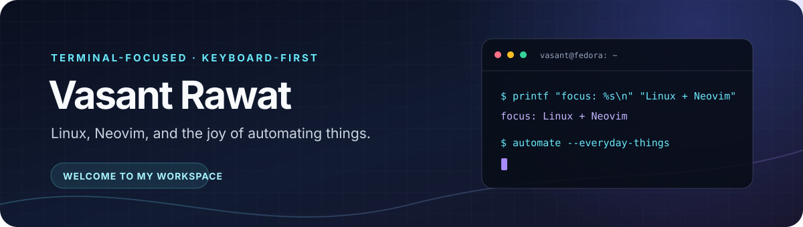

<h1 align="center">
  
</h1>

  
  
  

## Hey, I'm Vasant

I like building a workspace that stays out of the way: Fedora, a keyboard, Neovim, and small scripts for the repetitive stuff. My Linux journey started with a battle against NVIDIA drivers and turned into a long-running love of the command line.

> “Why use a mouse when you can do everything from the terminal?” — still my motto

## My daily setup

| Part | Setup |
|:--|:--|
| OS | Fedora |
| Window manager | dwm with custom patches |
| Editor | Neovim + LazyVim |
| Terminal | Alacritty + tmux |
| Shell | zsh + custom plugins |
| Font and theme | JetBrainsMono Nerd Font · Catppuccin 🌺 |

## Things I've built

- 🔮 **[NeoBegin](https://github.com/Vasant-rawat/NeoBegin)** — my Neovim setup, tuned to make every keystroke feel magical.
- 🎨 **[dwm Config](https://github.com/Vasant-rawat/dwm-readytoUse-Config)** — a minimal dwm setup with a little personality.

## In my toolkit

  
⚙️ Neovim plugins I reach for

  - [telescope.nvim](https://github.com/nvim-telescope/telescope.nvim) — fuzzy finding
  - [nvim-treesitter](https://github.com/nvim-treesitter/nvim-treesitter) — syntax parsing and highlighting
  - [nvim-lspconfig](https://github.com/neovim/nvim-lspconfig) — language server setup
  - [which-key.nvim](https://github.com/folke/which-key.nvim) — keybinding helper
  - [lazy.nvim](https://github.com/folke/lazy.nvim) — plugin manager

## A little GitHub activity

  
  

  <picture>
    <source media="(prefers-color-scheme: dark)" srcset="https://raw.githubusercontent.com/Vasant-rawat/Vasant-rawat/output/github-contribution-grid-snake-dark.svg" />
    
  </picture>

  <em>Side quest: automating my coffee breaks. The script exists; the hardware is still a TODO. ☕</em>

